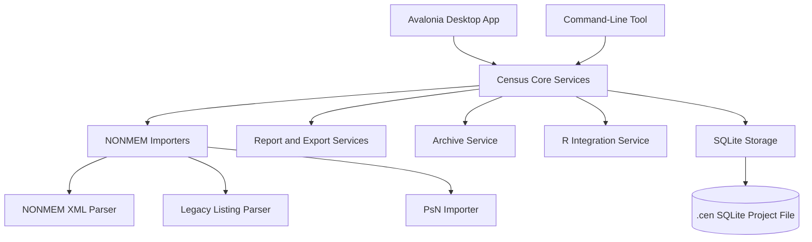

# Census Porting Strategy

## Overview

Census is a NONMEM run tracking and project management tool written in Object Pascal
with Lazarus. The current codebase still contains a lot of valuable domain behavior:
NONMEM XML/listing parsing, SQLite project storage, run comparison, report export,
run archiving, PsN support, and optional R integration.

The best porting strategy is not a direct line-by-line rewrite. The safer path is to
preserve the domain behavior first, extract it into a testable core, and then build a
modern cross-platform desktop shell around that core.

## Recommended Target

Use **C#/.NET with Avalonia UI** for the new implementation.

This choice is driven by the project's actual constraints, in priority order:

1. **A single compiled binary is a hard requirement.** .NET produces this via
   `PublishSingleFile` self-contained builds or NativeAOT. The user installs nothing —
   there is no runtime to locate or version-match. This rules out interpreter-bundled
   options (Python via PyInstaller and similar) and runtime-shipping options (Electron),
   which also bring the antivirus and Windows-install friction this project must avoid.
2. **Others must be able to modify it.** Object Pascal/Lazarus is too niche to attract
   contributors. C# is fully mainstream, and for a desktop project specifically it offers
   the best onboarding: clone, open in Visual Studio / Rider / VS Code, and run. The UI
   is also written in the same language as the core, so contributors need only one stack.
3. **Fewest moving parts on Windows.** Avalonia renders its own UI with Skia, so unlike
   web-shell toolkits (Tauri, Wails) it has **no WebView2 dependency**, no bundled
   browser, and no interpreter. The toolchain is Microsoft-native on Windows. This is the
   most reliable, lowest-surprise target for the "avoid dependency, antivirus, and Windows
   problems at all costs" requirement.
4. **Modern, robust interface.** Avalonia provides native-feeling, self-rendered widgets
   including mature `DataGrid` and `TreeDataGrid` controls that map directly onto the
   current run table and run tree.
5. **Fast database and parsing.** Compiled .NET with `Microsoft.Data.Sqlite` gives full
   native SQLite speed, and the import/parsing core is plain compiled code.

Avalonia targets Windows, macOS, and desktop Linux from a shared .NET codebase.

**Code signing is part of the deliverable, not an afterthought.** Any compiled binary —
.NET, Go, or Rust — can trip Windows SmartScreen or antivirus heuristics while unsigned.
An Authenticode certificate is the single highest-leverage mitigation for the antivirus
and Windows-install risks, and it applies regardless of language. Budget for it early
(see step 7).

Keep **SQLite** as the project file format. It matches the current `.cen` model and
avoids requiring a database server. Because there is **no requirement to preserve
backward compatibility**, the new application does not need to open or migrate databases
written by the Lazarus version, and it need not reproduce any ZEOS-specific behavior
(SQL dialect quirks, type affinity, or `BLOB` handling). The schema can be designed
cleanly for `Microsoft.Data.Sqlite` from the start. Existing `.cen` files remain useful
only as a regression oracle (see step 1), not as a runtime format.

## Current Codebase Observations

The repository suggests the following important boundaries:

| Area | Current Location | Notes |
| --- | --- | --- |
| Application entry point | `Census.lpr` | Lazarus application bootstrap and form creation. |
| Main UI and application logic | `main.pas` | Large form class mixing UI, parsing, persistence, import, export, archiving, and schema creation. |
| NONMEM XML binding | `nmoutput.pas` | Generated XML binding code from NONMEM output schema. Should be replaced rather than manually ported. |
| NONMEM listing/XML import | `main.pas`, `CaptureRunLst`, `CaptureRunXML` | Core behavioral logic that needs regression coverage before replacement. |
| SQLite schema | `main.pas`, `census.sql`, `empty.db` | Schema exists partly as SQL files and partly as Pascal schema creation methods. |
| Run reports | `exportrun.pas`, `runrec.pas`, `compare.pas` | CSV, HTML, and LaTeX outputs are string-built from SQLite queries. |
| Folder import | `importfolder.pas` | Discovers candidate run files and calls the main import methods. |
| R integration | `rproc.pas` | Launches an external R process and sends commands over stdin. |
| Options | `options.pas` | Stores external tool paths and filename conventions in INI configuration. |

The largest risk is that `main.pas` contains both the domain logic and the user
interface. A successful port should separate these concerns before the UI is rebuilt.

## Proposed Architecture



## Target Module Layout

| Module | Responsibility |
| --- | --- |
| `Census.Domain` | Domain models such as run, estimation, theta, omega, sigma, PsN result, warning, and file artifact. |
| `Census.Import` | NONMEM XML parsing, legacy listing parsing, PsN import, file discovery, MD5 calculation. |
| `Census.Storage` | SQLite access, migrations, project open/create/upgrade, repository queries. |
| `Census.Reports` | CSV, HTML, LaTeX, and future PDF/Quarto report generation. |
| `Census.Archive` | ZIP creation for selected runs and run artifacts. |
| `Census.ExternalTools` | NONMEM, PsN, Perl, R, and xpose/ggplot process integration. |
| `Census.Cli` | Headless commands for import, export, compare, archive, and migration testing. |
| `Census.App` | Avalonia MVVM desktop UI. |
| `Census.Tests` | Regression tests against known NONMEM outputs and existing `.cen` files. |

## Migration Plan

### 1. Freeze Current Behavior

Collect representative fixtures before writing the new app:

- Existing `.cen` databases.
- NONMEM 7.2+ XML output files.
- Legacy NONMEM listing files if still supported.
- PsN output folders.
- Current CSV, HTML, and LaTeX exports.
- Run archives created by the current application.

Create regression tests that assert the new importer produces the same key stored
values as the Lazarus version: run number, parent run, OFV, dOFV, theta/omega/sigma
values, standard errors, shrinkage, condition number, warnings, and file references.

### 2. Build a Headless Core First

Before rebuilding the UI, create a command-line tool that exercises the domain logic:

```text
census import run.xml project.cen
census import-folder ./runs project.cen
census export-run RUNNO --format html
census export-run RUNNO --format csv
census compare project.cen
census archive RUNNO --include-data
```

This keeps the hardest behavior testable without needing desktop UI automation.

### 3. Define and Version the SQLite Format

Keep `.cen` as SQLite, but replace ad hoc table creation with a clean schema and explicit
migrations. Since backward compatibility with Lazarus-era databases is not required, this
step is purely forward-looking: it governs how the *new* application evolves its own
schema over time, not how it reads old files.

Recommended behavior:

- Create the schema from versioned migration scripts, not ad hoc table creation.
- Store a schema version in a metadata table from the first release.
- Apply migrations idempotently and back up before applying them.
- Design the schema natively for `Microsoft.Data.Sqlite` (no ZEOS quirks to carry over).

### 4. Reimplement Importers

Port import behavior by feature, not by file. Note that the importers are larger than a
single line each suggests, and should be scoped accordingly:

- Start with NONMEM XML import, since it is the modern path.
- Replace `nmoutput.pas` generated bindings (1,846 lines, generated in 2011 from the
  NONMEM 7.2.0 `output.xsd`) with schema-aware XML traversal and typed domain objects.
  Regenerate against the current XSD rather than reproducing the old binding.
- **PsN import is a major work item, not a bullet.** PsN handling accounts for ~200
  references in `main.pas` and parses output formats that drift between PsN versions.
  Treat it as its own milestone with its own fixture set per PsN version of interest.
- **Legacy listing parsing is regex-heavy and brittle.** The current `CaptureRunLst`
  path leans on the vendored 4,000-line `regexpr.pas`. Port it only if users still need
  it, and only behind a thorough fixture suite — this is the parser most exposed to
  silent regressions.
- Add parser tests for edge cases called out in the changelog, such as `$OMEGA`
  labels, mixture models, prior handling, and control streams with spaces in paths.

### 5. Rebuild Reports and Exports

Move report generation out of forms and into services:

- CSV export should use structured writers, not hand-built delimited strings.
- HTML export should use templates.
- LaTeX export should escape special characters consistently.
- Consider adding Quarto/PDF later, but do not make it part of the first port unless
  users need it immediately.

### 6. Rebuild the Desktop UI

Use Avalonia with MVVM.

Initial screens should match the current workflows rather than trying to redesign the
entire product:

- Project open/create/recent files.
- Run table.
- Run tree.
- Run detail tabs.
- Theta, omega, sigma, estimation, covariance, and table views.
- Import run and import folder.
- Compare runs.
- Export run report and run record.
- Options for NONMEM, PsN, Perl, R, and filename conventions.

The desktop UI should call the same services used by the CLI.

### 7. Automate Cross-Platform Builds

Set up CI early for:

- Windows x64.
- macOS Apple Silicon and Intel if practical.
- Linux x64.

The CI should run parser/storage/report tests on every platform.

**Treat Windows code signing as an early CI deliverable, not a late polish step.** It is
the single highest-leverage mitigation for the antivirus false positives and Windows
SmartScreen warnings this project must avoid, and an unsigned binary will generate
exactly those problems for end users. Provision an Authenticode certificate, wire signing
into the Windows build job, and validate the signed artifact on a clean Windows machine
before wider packaging work. macOS notarization can follow once the core workflows are
stable.

## Alternatives Considered

The decision is governed by four non-negotiable constraints: a **single compiled binary**,
a **mainstream language others can modify**, a **modern and robust interface**, and
**no significant external dependencies, antivirus false positives, or Windows install
friction**. Those constraints eliminate several otherwise-reasonable options outright.

### Eliminated by the constraints

**Python + PySide6/Qt.** Closest to the scientific user base and the fastest path for a
data-oriented maintainer, but it cannot produce a true single compiled binary. PyInstaller
and similar bundlers ship an embedded interpreter, producing large artifacts with slow
cold start and frequent Windows antivirus false positives — precisely the failure modes
to be avoided at all costs. Eliminated.

**Electron.** Mature and cross-platform, but ships a full Chromium runtime. Not a compiled
binary, heavier than Census needs, and the application has no browser-first requirement.
Eliminated.

**R / Shiny.** A natural fit for the pharmacometrics audience, but it is a server/web
runtime, not a single compiled desktop binary. Eliminated by the binary requirement.

**Continue with Lazarus.** The least disruptive short-term option, and it already produces
a single native binary. Eliminated for the reason that motivated this whole effort:
**Object Pascal/Lazarus is too niche to attract outside contributors.** (Worth noting that
the doc's *method* — extract a tested core, build a CLI, add migrations — would work in
FPC too; the language's contributor pool, not its technical capability, is the blocker.)

### Real finalists (all satisfy the single-binary requirement)

**Go + Wails.** Produces the smallest static binary, and Go is the easiest language here
for new contributors. Pure-Go SQLite (`modernc.org/sqlite`) keeps builds free of a C
toolchain. The trade-offs versus Avalonia: the UI is a **web frontend in a system
webview**, so it depends on **WebView2** being present and asks contributors to also know
a web stack. Strong runner-up, and the right pick if a web-based UI is preferred.

**Rust + Tauri.** The smallest and fastest native footprint, with excellent parsing
performance. Not recommended here because Rust's learning curve directly contradicts the
"others can modify" priority, and like Wails it depends on a system webview for the UI.

**C++ + Qt.** Technically the most capable desktop option on paper: Qt is the most mature
cross-platform widget toolkit, with first-class data grids and tree views, and C++ gives
top-tier parsing and SQLite performance. It is not recommended here for three reasons that
map directly onto the stated constraints:

- *Contributor barrier.* C++ (manual memory management, headers, CMake/qmake build setup)
  is the hardest of the finalists for outside contributors — it works against the central
  reason for porting away from Pascal. Qt also adds its own large API surface to learn.
- *Single-binary and dependency friction.* A default Qt build is **not** a single file;
  it depends on Qt DLLs deployed via `windeployqt`. A true single binary requires static
  linking, which under Qt's open-source LGPL terms carries licensing obligations (and the
  cleaner static story effectively pushes toward a commercial Qt license). This is exactly
  the dependency/install complexity to be avoided.
- *Toolchain weight on Windows.* The MSVC/Qt build and deployment chain is heavier and
  more failure-prone than the Microsoft-native .NET toolchain.

Qt would be the right answer if maximum UI maturity and raw performance outranked
contributor accessibility and a frictionless single-binary deploy. Given this project's
priorities, they do not.

**C#/.NET + Avalonia (recommended).** Best balance across all four constraints: single
self-contained or NativeAOT binary, a fully mainstream language with the best desktop
clone-and-run onboarding, a self-rendered native UI with **no WebView2 dependency**, and a
Microsoft-native Windows toolchain that minimizes dependency and install surprises. See
**Recommended Target**.

## Recommendation

Proceed with an **Avalonia/.NET port built on a CLI-first core and a clean SQLite schema**.

Among options that meet the single-binary requirement, Avalonia best satisfies the rest:
a mainstream language others can modify, a self-rendered native UI with no webview
dependency, a Microsoft-native Windows toolchain, and fast compiled parsing and storage.
Code signing is part of the deliverable.

The guiding principle is to treat the current Pascal app as the behavioral oracle, not as
the structure to reproduce — and not as a format to stay compatible with. Reproduce its
*output values*, not its files; replace the implementation in small, testable slices;
then rebuild the desktop interface on top of the new core.

